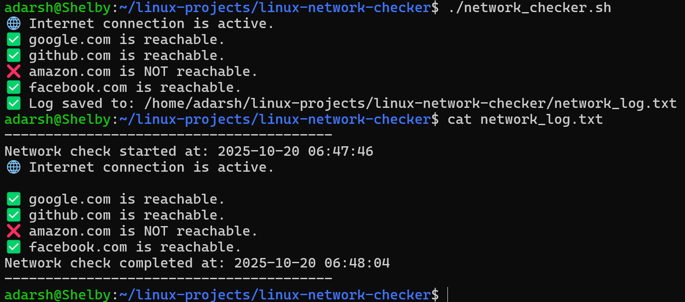

# 🌐 Linux Website Availability Checker

### 👨‍💻 Author

**Adarsh Shivan**<br>GitHub: [https://github.com/adarshshivan](https://github.com/adarshshivan)

---

## 📘 Overview

The Linux Website Availability Checker is a Bash-based automation tool that checks whether websites are online or offline by pinging their servers.
It’s designed to help users, administrators, and learners quickly test multiple website statuses right from the terminal.
The script supports both real checks and a safe simulation mode for demo or testing purposes — perfect for portfolios or learning environments.

---

## 🧰 Features
- Checks multiple website statuses at once
- Displays real-time online/offline results
- Customizable list of domains
- Safe simulation mode available (no network pinging required)
- Lightweight and fast — pure Bash

---

## ⚙️ Tools & Technologies Used
- 🐧 Linux / WSL (Ubuntu)
- 💻 Bash Scripting
- 🌍 ping Command
- 🧾 GitHub (for version control)
- ✍️ VS Code / Nano (for editing scripts)

---

## 🧩 How It Works
1. The script reads a list of websites from an array or file.
2. It sends a ping request to each site.
3. If the website responds, it’s marked as Online ✅; otherwise, Offline ❌.
4. The results are neatly printed in the terminal.

---

## ▶️ Usage Instructions

### 1️⃣ Make It Executable
```bash
chmod +x website_checker.sh
```

### 2️⃣ Run the Script
```bash
bash website_checker.sh
```

or (if executable):

```bash
./website_checker.sh
```

---

### 📂 Example Output

▶️ After Running



---

### 🎓 What I Learned

- Automating network checks using Bash scripting
- Handling online/offline logic using the ping command
- Creating safe and demo-friendly versions of system scripts
- Formatting clean terminal output for better readability
- Structuring projects for portfolio presentation

---

### 🧠 Project Summary

The Website Availability Checker is a Linux-based automation script designed to test multiple websites’ availability and display their status directly in the terminal.
It’s built for quick diagnostics, learning, and showcasing Bash scripting skills.
The project includes both real and safe simulated modes, making it suitable for both practice and portfolio use.

This project demonstrates proficiency in:

Network monitoring through Bash

Process and command handling

Real-time terminal formatting
